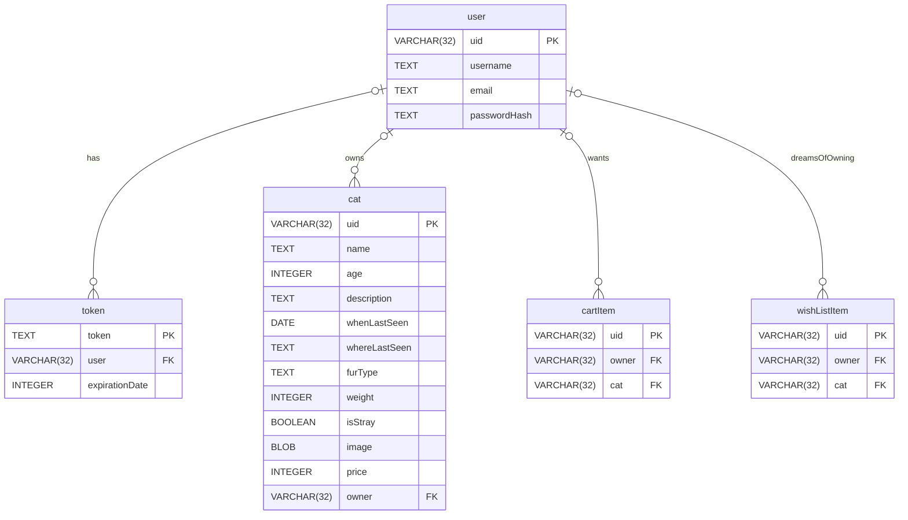

# Database Structure
Entity-Relationship diagram for the database in the API.

```mermaid
erDiagram

    user {
        VARCHAR(32) uid PK
        TEXT username
        TEXT email
        TEXT passwordHash
        %% check in future if OPT should be added %%
    }
    
    token {
        TEXT token PK
        VARCHAR(32) user FK
        INTEGER expirationDate
    }
        
    cat {
        VARCHAR(32) uid PK
        TEXT name
        INTEGER age
        TEXT description
        DATE whenLastSeen
        TEXT whereLastSeen
        TEXT furType
        INTEGER weight
        BOOLEAN isStray
        BLOB image
        INTEGER price
        VARCHAR(32) owner FK
    }
    
    cartItem {
        VARCHAR(32) uid PK
        VARCHAR(32) owner FK
        VARCHAR(32) cat FK
    }

    wishListItem {
        VARCHAR(32) uid PK
        VARCHAR(32) owner FK
        VARCHAR(32) cat FK
    }
    
    user |o--o{ token : has
    user |o--o{ cat : owns
    user |o--o{ cartItem : wants
    user |o--o{ wishListItem : dreamsOfOwning

```

