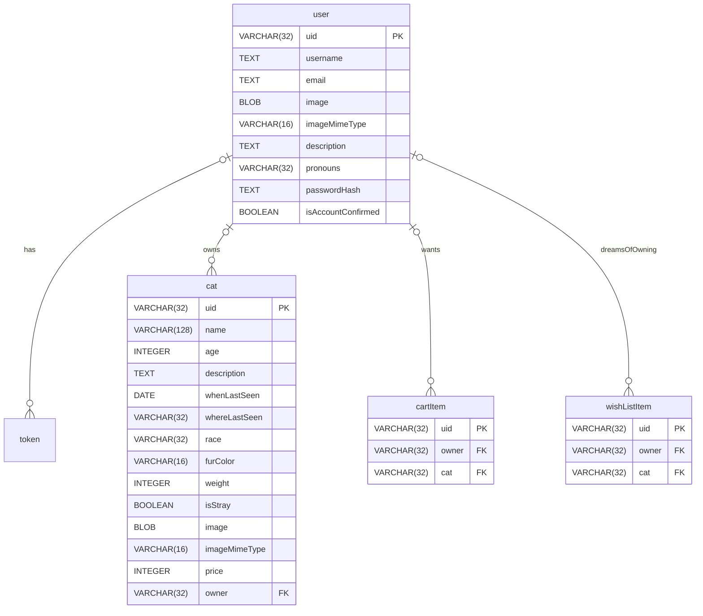

# Database Structure
Entity-Relationship diagram for the database in the API. Please note that this document is subject to updates when the 
Analyst gives us updates on the project strucutre.


## Details on the Database
- **Type**: MariaDB

## SQL Schema
```sql
CREATE TABLE IF NOT EXISTS users(
    uid VARCHAR(32) PRIMARY KEY,
    username VARCHAR(32) NOT NULL,
    email VARCHAR(64) NOT NULL,
    image BLOB,
    imageMimeType VARCHAR(16),
    description TEXT,
    pronouns VARCHAR(32),
    passwordHash TEXT NOT NULL,
    isAccountConfirmed BOOLEAN NOT NULL DEFAULT FALSE
);

CREATE TABLE IF NOT EXISTS cats(
    uid VARCHAR(32) PRIMARY KEY,
    name VARCHAR(128) NOT NULL,
    age INTEGER,
    description TEXT,
    whenLastSeen DATE,
    whereLastSeen VARCHAR(32),
    race VARCHAR(32),
    furColor VARCHAR(16),
    weight INTEGER,
    isStray BOOLEAN,
    image BLOB,
    imageMimeType VARCHAR(16),
    price INTEGER,
    owner VARCHAR(32),
    FOREIGN KEY(owner) REFERENCES users(uid)
);

CREATE TABLE cartItems(
    uid VARCHAR(32) PRIMARY KEY,
    owner VARCHAR(32), cat VARCHAR(32),
    FOREIGN KEY(owner) REFERENCES users(uid),
    FOREIGN KEY(cat) REFERENCES cats(uid)
);

CREATE TABLE wishListItems(
    uid VARCHAR(32) PRIMARY KEY,
    owner VARCHAR(32), cat VARCHAR(32),
    FOREIGN KEY(owner) REFERENCES users(uid),
    FOREIGN KEY(cat) REFERENCES cats(uid)
);


CREATE TABLE cartItems(
    uid VARCHAR(32) PRIMARY KEY,
    owner VARCHAR(32), cat VARCHAR(32),
    FOREIGN KEY(owner) REFERENCES users(uid),
    FOREIGN KEY(cat) REFERENCES cats(uid)
);

CREATE TABLE wishListItems(
    uid VARCHAR(32) PRIMARY KEY,
    owner VARCHAR(32), cat VARCHAR(32),
    FOREIGN KEY(owner) REFERENCES users(uid),
    FOREIGN KEY(cat) REFERENCES cats(uid)
);

```


