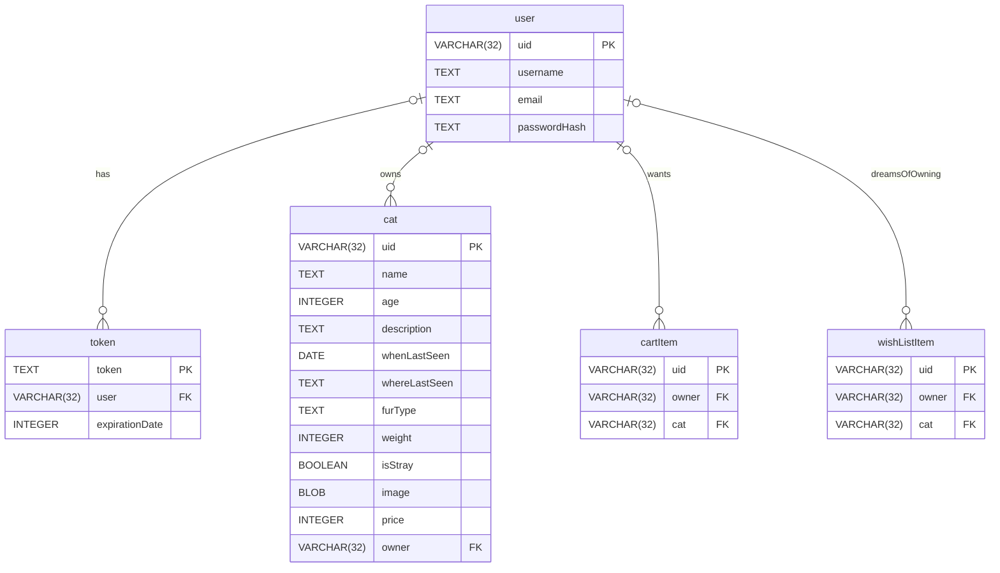

# Database Structure
Entity-Relationship diagram for the database in the API. Please note that this document is subject to updates when the 
Analyst gives us updates on the project strucutre.


## Details on the Database
- **Type**: SQLite3
- **Single Connection**
- **No active enforcement of Foreign Keys**
    Do not run `PRAGMA foreign_keys = "on";` as this would disallow `NULL` values in foreign keys, whih are used to represent 
    not owned cats.

## SQL Schema
```sql
CREATE TABLE users(
    uid VARCHAR(32) PRIMARY KEY,
    username TEXT NOT NULL,
    email TEXT NOT NULL,
    passwordHash TEXT NOT NULL
);

CREATE TABLE tokens(
    token TEXT PRIMARY KEY,
    user VARCHAR(32) NOT NULL,
    expirationDate INTEGER,
    FOREIGN KEY(user) REFERENCES users(uid)
);

CREATE TABLE cats(
    uid VARCHAR(32) PRIMARY KEY,
    name TEXT NOT NULL,
    age INTEGER,
    description TEXT,
    whenLastSeen DATE,
    whereLastSeen TEXT,
    furColor TEXT,
    weight INTEGER,
    isStray BOOLEAN,
    image BLOB,
    price INTEGER,
    owner VARCHAR(32),
    FOREIGN KEY(owner) REFERENCES users(uid)
);

CREATE TABLE cartItems(
    uid VARCHAR(32) PRIMARY KEY,
    owner VARCHAR(32), cat VARCHAR(32),
    FOREIGN KEY(owner) REFERENCES users(uid),
    FOREIGN KEY(cat) REFERENCES cats(uid)
);

CREATE TABLE wishListItems(
    uid VARCHAR(32) PRIMARY KEY,
    owner VARCHAR(32), cat VARCHAR(32),
    FOREIGN KEY(owner) REFERENCES users(uid),
    FOREIGN KEY(cat) REFERENCES cats(uid)
);

```


